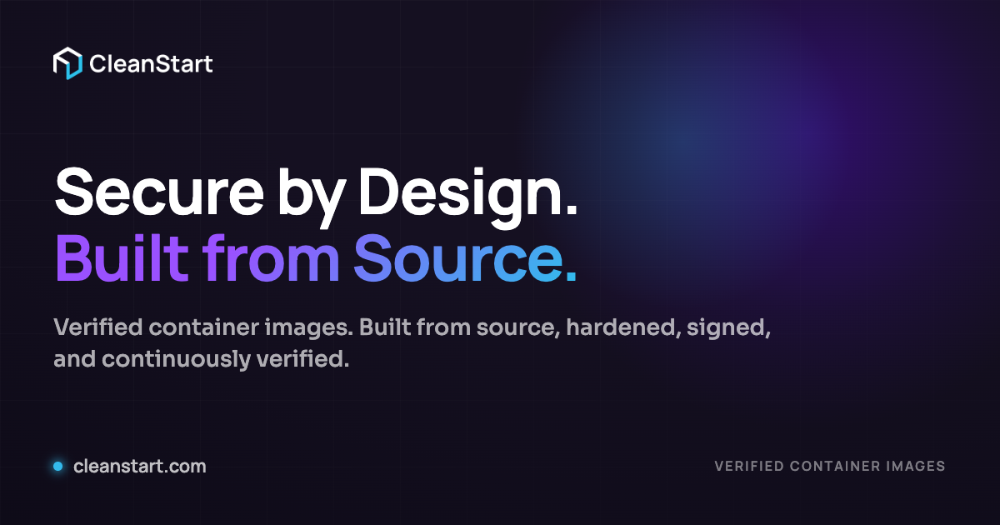
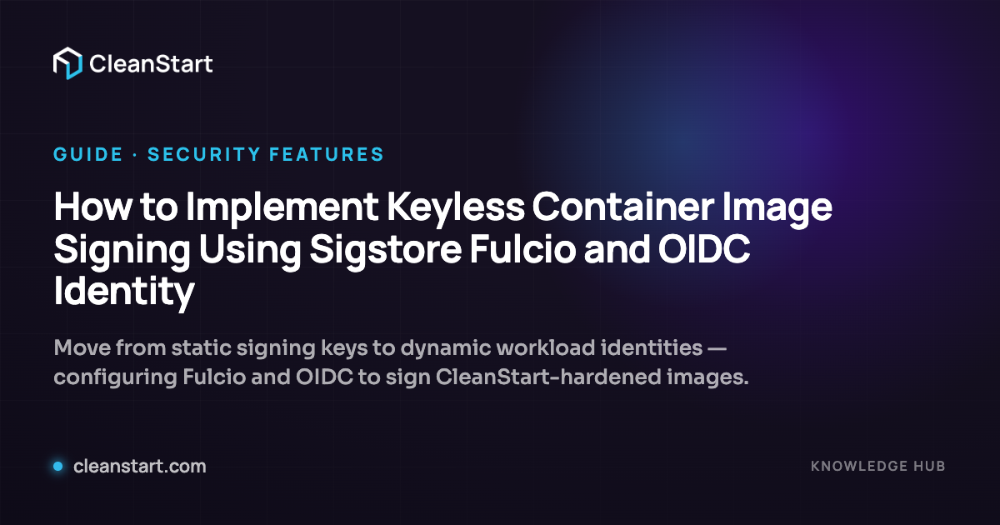

# OG Image Design System — design spec

**Date:** 2026-05-29
**Status:** approved (brainstorm output)
**Scope:** `apps/web` — dynamic Open Graph / Twitter card images for every page type.
**Supersedes:** the earlier same-dated draft (single full-bleed template, invented gradient) and the dropped-in static `apps/web/public/og/default.png`. Both are discarded; nothing in this spec derives from them.

> Every value below is read verbatim from the repository (sources cited inline). No invented branding, colours, headlines, or product names.

---

## 1. Context & decision

`buildPageMetadata` ([apps/web/src/lib/seo/canonical.ts:62](../../../apps/web/src/lib/seo/canonical.ts)) currently points **every** page's `og:image` and `twitter:image` at one static file, `/og/default.png`. That file is missing from the contract (the committed one is 1 MB — ~3.5× over the repo's own < 300 KB budget in [public/og/README.md](../../../apps/web/public/og/README.md)) and cannot scale to unbounded CMS detail pages. Social/Slack/LinkedIn shares are therefore unbranded or heavy.

**Decision:** one dynamic Satori (`next/og`) endpoint renders every card on demand, in **two variants**, wired through the existing `buildPageMetadata` helper. CMS pages keep their per-post `seo.ogImage` override (already wired via `resolveCmsSeo`). No hand-maintained PNGs; nothing goes stale when a title changes.

**Tiering (chosen approach):** bespoke **`hero`** treatment for the three flagship surfaces (Homepage, CleanStart Images, CleanSight); one shared **`default`** system card for the entire long tail. Both variants come from the *same* endpoint and share one brand substrate, so there is a single code path.

---

## 2. Brand truth (verbatim, with sources)

**Colours** ([globals.css](../../../apps/web/src/app/globals.css)):

| Token | Value | Source |
|---|---|---|
| navy (darkest, base) | `#151021` | `globals.css:75` |
| navy 2 | `#10123e` | `globals.css:76` |
| blue | `#131e8f` | `globals.css:77` |
| purple / purple-2 | `#471ec0` / `#551ec3` | `globals.css:78,80` |
| decorative blob | `#640DFB` (@0.30 in hero) | `globals.css:382` |
| cyan / cyan-2 | `#2cc1eb` / `#33baec` | `globals.css:81,82` |
| lavender | `#dab6f3` | `globals.css:83` |

**Signature headline accent** (`.cs-text-gradient-impact`): `linear-gradient(-44deg, #2CC1EB 0%, #9A51FF 65%)` — cyan→purple — `globals.css:2234`.
**Hero mesh:** `linear-gradient(180deg, rgba(21,16,33,1) 0%, … rgba(66,30,188,0) 99%)` (8 stops) — `globals.css:367-377`.
**Grid:** white lines @ `0.04`, `background-size:80px 80px` — `globals.css:480-484`.
**Fonts:** Manrope (display/headings, `globals.css:13`) + Sora (body/marketing, `globals.css:12`). Allowed weights 400/500/600/700 ([TYPOGRAPHY-SYSTEM.md:19](../../../apps/web/docs/TYPOGRAPHY-SYSTEM.md)).
**Logo (light, for dark card):** `apps/web/public/images/logo-cleanstart-footer.png`, **459×96** → render at **191×40** (height 40). Other logos: `logo-cleanstart-nav.png` 153×32, `logo-cleanstart.png` 306×64, `logo-cleanstart-mark.svg` viewBox `0 0 27.7958 31.9969`.

**SEO layer** ([canonical.ts](../../../apps/web/src/lib/seo/canonical.ts), [cms-seo.ts](../../../apps/web/src/lib/seo/cms-seo.ts)): `SITE_URL = https://www.cleanstart.com`, `SITE_NAME = CleanStart`, twitter card `summary_large_image`. `resolveCmsSeo` maps CMS `seo.ogImage`/`seo.title`/`seo.description` into the metadata, and `buildPageMetadata` sets og + twitter to one image with the override order **explicit `image` → CMS `seo.ogImage` → default**.

---

## 3. Card design system (1200×630)

### 3.1 Shared substrate (both variants)

| Layer | Spec |
|---|---|
| Base | solid `#151021` |
| Purple mesh glow | `radial-gradient(circle, rgba(100,13,251,0.34) 0%, rgba(100,13,251,0.10) 42%, rgba(21,16,33,0) 70%)`, ~720px, offset `top:-200 right:-130` |
| Cyan accent glow | `radial-gradient(circle, rgba(44,193,235,0.22) 0%, rgba(21,16,33,0) 62%)`, ~460px, upper-right |
| Grid | white-line grid @ 0.04, 80px cells, **rendered as a baked SVG layer** (Satori cannot tile `background-size`); diagonally masked so it fades top-left→out |
| Vignette | `radial-gradient(135% 135% at 68% 14%, rgba(21,16,33,0) 30%, rgba(8,6,16,0.74) 100%)` — darkens edges, focuses lower-left |
| Padding | 56px (top/bottom) · 64px (sides) — the text safe margin |
| Logo | `logo-cleanstart-footer.png`, **191×40**, top-left, explicit width/height (never flex-stretch — see note) |
| Footer | left: glowing cyan dot (`#33baec`, soft shadow) + `cleanstart.com` (22px/600, `rgba(255,255,255,0.74)`); right: uppercase meta (16px/600, `letter-spacing:0.14em`, `rgba(255,255,255,0.45)`) |

> **Logo flex note (mockup bug, fixed in spec):** in a flex column the default `align-items:stretch` stretches the `` to full width. The logo MUST set explicit `width:191px; height:40px` **and** `align-self:flex-start`.

### 3.2 Variant A — `hero` (Homepage · CleanStart Images · CleanSight)

- **Layout:** logo top-left → large two-tone headline lower-left (≤1000px wide) → one-line sub → footer. Right third is negative space holding the purple glow.
- **Headline:** Manrope **700**, **76px** (auto-shrink to 64px when long), line-height **1.05**, letter-spacing **−0.02em**, white; the real accent phrase rendered in `linear-gradient(-44deg, #2CC1EB 0%, #9A51FF 65%)` via `backgroundClip:text`.
- **Sub:** Sora **500**, **27px**, `rgba(255,255,255,0.66)`, line-height 1.4, ≤880px, ≤2 lines.

### 3.3 Variant B — `default` (everything else)

- **Layout:** logo top-left → cyan eyebrow → title → sub → footer (category meta right).
- **Eyebrow:** Manrope **700**, **22px**, `letter-spacing:0.18em`, uppercase, cyan `#2cc1eb`, margin-bottom 22px. Omitted only if no label exists.
- **Title auto-size** (by character count): ≤55 → **60px** · 56–80 → **52px** · >80 → **46px** (clamp to 3 lines, ellipsis). Manrope 700, white, line-height 1.1, letter-spacing −0.015em, ≤1010px.
- **Sub:** Sora 500, 25px, `rgba(255,255,255,0.66)`, ≤940px, ≤2 lines (from `description`/abstract).

### 3.4 Approved mockups (pixel-exact HTML render, real logo + real text)

---

## 4. Per-page-type application

| # | Page type | Variant | Eyebrow | Title source | Sub source |
|---|---|---|---|---|---|
| 1 | **Homepage** | hero | — | `Secure by Design. Built from Source.` (accent *Built from Source.*) | site description |
| 2 | **Product** — CleanStart Images / CleanSight / CleanStart SBOM | hero | product name | hero H1 (accent *Foundations* / *Remediation*) | product subhead |
| 3 | **Solutions** — ASR · FIPS · Vulnerability Remediation · CISO · For Developers · SCA | default | `SOLUTIONS` | page metadata title | page description |
| 4 | **Blog** | default | category, else `BLOG` | post title | abstract |
| 5 | **Resources** | default | resource `type` (`WHITEPAPER`/`EBOOK`/`DATASHEET`/`ARCHITECTURE INSIGHTS`/`REPORT`) | resource title | summary |
| 6 | **Knowledge Hub** | default | `GUIDE` (+ category) | article title | lead |
| 7 | **Events** | default | `EVENT` | event title | abstract |
| 8 | **News** | default | `pressType` (`PRESS RELEASE`/`NEWS`/`ANNOUNCEMENT`/`FEATURE`) | news title | abstract |
| 9 | **Careers** | default | `CAREERS` (+ department) | role / listing title | description |
| 10 | **Team / Author** | default | `TEAM` / author `role` | `Meet the Team & Leadership` / author name | description / bioShort |

**Real headlines used by the hero cards (verbatim):**
- Homepage — metadata title `CleanStart — Secure by Design. Built from Source.`; description `Verified container images. Built from source, hardened, signed, and continuously verified.` ([page.tsx:23](../../../apps/web/src/app/page.tsx))
- CleanStart Images — hero H1 `Trusted Container Foundations` (accent *Foundations*), sub `Minimal, hardened, verifiable container images built from trusted sources and continuously rebuilt to reduce inherited risk.` ([CleanStartImagesHero.tsx:84](../../../apps/web/src/components/sections/cleanstart-images/CleanStartImagesHero.tsx))
- CleanSight — hero H1 `Continuous Visibility. Continuous Remediation.` (accent *Remediation.*), sub `Continuously discover, assess, and remediate container risk across modern environments.` ([CleanSightHero.tsx:52](../../../apps/web/src/components/sections/cleansight/CleanSightHero.tsx))

**Excluded:** PodcastEpisodes — no SEO field group and no mapped detail route ([PodcastEpisodes.ts](../../../apps/cms/src/payload/collections/PodcastEpisodes.ts)). Falls back to the homepage default card if ever linked.

---

## 5. Title / eyebrow sourcing

`buildPageMetadata` gains three optional fields:
- `variant?: "hero" | "default"` — default `"default"`; the three flagship pages pass `"hero"`.
- `eyebrow?: string` — type/category label (table §4). Detail pages pass their content type; static pages pass a section label or omit.
- `titleAccent?: string` — the substring of the title rendered in the gradient. If present and found (case-insensitive, last match), that portion is gradient; otherwise the whole title is white (still clean — accent is an enhancement, never required).

Detail pages already pull `seo.title ?? item.title` and `seo.description ?? abstract`; they only add `eyebrow` (and `variant` stays default). The three hero pages add `variant:"hero"`, `eyebrow`, and `titleAccent`.

---

## 6. Safe zones · crops · platform previews

- **Outer safe margin** 64px sides / 56px top-bottom; logo, headline, and footer all sit inside it; category meta ≥64px from the right edge.
- **LinkedIn** renders 1200×627 and may crop to 1.91:1 — text already inside the 64px margin, so nothing clips.
- **X / `summary_large_image`** displays ~2:1 and trims a few px top/bottom — the 56px vertical margin covers it.
- **Mobile feeds / iMessage** round the corners and lightly center-crop — nothing critical lives in the outer 64px ring, so rounding never touches the logo or headline.
- **Slack / Discord / Facebook** render the full 1.91:1 — the primary target, no compromise.

---

## 7. Satori constraints (baked into the implementation)

- No `filter: blur`, no `mix-blend-mode`, no CSS `grid`. Soft glows are multi-stop **radial gradients**; the line grid is a **baked SVG** layer, not `background-size` tiling.
- Every element with >1 child must set `display:flex`.
- Fonts must be supplied as raw byte buffers — **WOFF or TTF, never WOFF2**. Bundle Manrope 600/700 + Sora 500 (and 400 if the footer needs it) as files read at request time.
- Gradient text uses `backgroundImage` + `backgroundClip:"text"` + `color:"transparent"`; if a Satori build renders it invisible, fall back to a solid `#2cc1eb` accent (verified at runtime).
- Logo `` is fetched from the request `origin` (works on localhost and prod) with explicit width/height.

---

## 8. Runtime & performance

- `export const runtime = "edge"`.
- Deterministic output from params → `Cache-Control: public, immutable, no-transform, max-age=31536000`. Fonts/SVG loaded once per cold start.
- Input hardening: clamp `title` (≤200), `eyebrow` (≤40), `accent` (≤120), `sub` (≤160) before render. All are query params → treated as untrusted; rendered only as Satori text nodes (no HTML injection).

---

## 9. Architecture & wiring

- **New Edge route `apps/web/src/app/api/og/route.tsx`** → `ImageResponse` (1200×630) from `?variant&title&eyebrow&accent&sub`.
- **`buildPageMetadata`** derives the default OG URL via a pure `ogImageUrl(...)` builder (`lib/seo/og.ts`) and sets both `openGraph.images` and `twitter.images` to the absolute `/api/og?…` URL (built off `SITE_URL`). This replaces `DEFAULT_OG_IMAGE`.
- **Override chain (unchanged, takes precedence):** explicit `image` arg → CMS `seo.ogImage` (via `resolveCmsSeo`) → dynamic card.
- **Root layout** ([layout.tsx](../../../apps/web/src/app/layout.tsx)) uses the dynamic hero URL for the homepage default.

---

## 10. Edge cases

- **Missing title** → fall back to `CleanStart — Secure by Design. Built from Source.`
- **No eyebrow** → eyebrow + footer-meta omitted (title + logo only).
- **No `titleAccent`** → whole title renders white.
- **Very long single word** → `overflow:hidden` + 3-line clamp prevents overflow.
- **Off-production** → image still generates (brand art, not indexable); the page's `robots` noindex already governs indexing on preview hosts.
- **`og:image:alt`** → already derived from title by `buildPageMetadata`; keep.

---

## 11. Files

- **New:** `apps/web/src/app/api/og/route.tsx`; `apps/web/src/app/api/og/render.ts` (+ test) for `pickTitleSize`/`splitTitleAccent`; `apps/web/src/lib/seo/og.ts` (+ test) for `ogImageUrl`; bundled fonts under `apps/web/src/app/api/og/fonts/`; the baked grid SVG.
- **Modified:** `apps/web/src/lib/seo/canonical.ts` (add `variant`/`eyebrow`/`titleAccent`, default OG → dynamic URL, drop `/og/default.png`); `apps/web/src/app/layout.tsx`; the three hero pages (`page.tsx`, `cleanstart-images/page.tsx`, `cleansight/page.tsx`) add `variant`/`eyebrow`/`titleAccent`; long-tail detail pages add `eyebrow`.
- **Removed:** `apps/web/public/og/default.png` (1 MB) and its README TODO once the dynamic default is live.

---

## 12. Verification

1. `GET /api/og?variant=hero&title=Secure%20by%20Design.%20Built%20from%20Source.&accent=Built%20from%20Source.` → `200 image/png`, 1200×630, matches the hero mockup.
2. `default` variant with a long title + eyebrow renders within bounds (matches the guide mockup).
3. View source on real pages → `og:image`/`twitter:image` point at the right `/api/og?…` URL; a CMS post with `seo.ogImage` still wins.
4. Validate one URL in a social-card validator (opengraph.xyz / the CMS `SocialCardField` preview) for OG + Twitter.
5. `pnpm --filter @cleanstart/web` → `lint ✓ · typecheck ✓ · build ✓` (with `ƒ /api/og` in the route table).

---

## 13. Out of scope (this pass)

- Per-type accent **colours** (single cyan→purple accent across all types).
- Author/portrait imagery on cards (text-only system).
- Localised cards.
